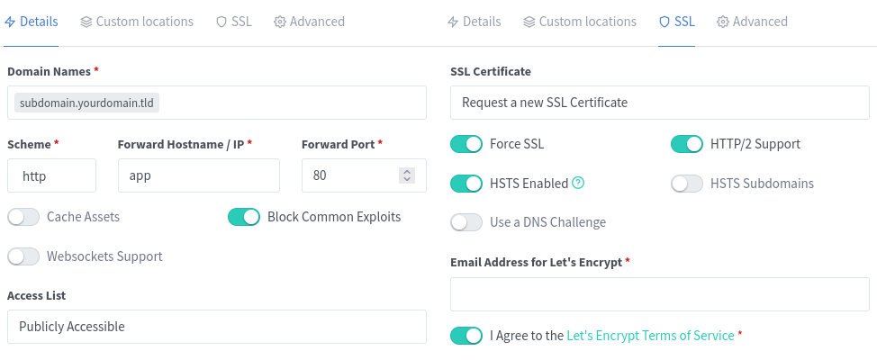

# Nextcloud for Raspberry Pi
This repository contains a `docker-compose.yml` file to deploy a Nextcloud instance on a Raspberry Pi. Successfuly tested on a Raspberry Pi 4 B running [Arch Linux ARM](https://archlinuxarm.org/platforms/armv8/broadcom/raspberry-pi-4).

It uses the plain official Nextcloud (not NextCloudPi) Docker image as well as MariaDB and the [Nginx Proxy Manager](https://nginxproxymanager.com/guide/#quick-setup), which allows for easy configuration including LetsEncrpyt SSL certificates.
The `mariadb` image is replaced with a custom build for `armhf` architectures with special thanks to [jsurf](https://hub.docker.com/r/jsurf/rpi-mariadb).
The former fully integrated solution with `nginx-proxy` and `letsencrypt-nginx-proxy-companion` prepared by [alexanderkrause](https://github.com/Alexander-Krause/rpi-docker-letsencrypt-nginx-proxy-companion) has unfortunately [stopped working recently](https://github.com/nextcloud/docker/issues/1473).

## Prerequisites
- [Docker installation](https://phoenixnap.com/kb/docker-on-raspberry-pi)
- [`docker-compose` installation](https://dev.to/rohansawant/installing-docker-and-docker-compose-on-the-raspberry-pi-in-5-simple-steps-3mgl)
- Public IP (using i.e. DynDNS, MyFRITZ!, ...) and (sub-) domain pointing to it
- Port redirection for external connections on port 80 and 443

## Deployment
1. Configure variables and credentials (e.g., generated by KeePass) in `nextcloud-variables.env` and `mysql-variables.env`
1. Configure the volume storing your Nextcloud user data
    - Mount an external HDD, e.g. to `/media/usbssd` by adding the following line to `/etc/fstab`:
        ```
        UUID=<UUID from sudo blkid> /media/usbssd   ext4    defaults,nofail	0	0
        ```
    - Create a data folder, e.g. `mkdir -p /media/usbssd/nextcloud-data`
    - `chown www-data:root /media/usbssd/nextcloud-data` or `chown http:root /media/usbssd/nextcloud-data` on Arch Linux
    - `chmod 770 /media/usbssd/nextcloud-data`
    - ...or delete the line `- /media/usbssd/nextcloud-data:/var/www/html/data` to simply use the main Docker volume `nextcloud` for your data
1. Run `docker-compose up -d`
1. Navigate to [http://raspberrypi:81](http://raspberrypi:81), login with `admin@example.com:changeme` (allow a few seconds and retry if you get _Bad Gateway_) and configure your account
1. Add a proxy host for your desired domain pointing to host `app` on port 80 with LetsEncypt enabled:

1. Navigate to your domain and configure your admin account (the database connection should automatically be configured with the credentials specified in `mysql-variables.env` on host `db`)
1. Enjoy your nextcloud instance!

## Updates
To update all images, simply run
1. `docker-compose pull`
2. `docker-compose up -d`
3. and optionally `docker image prune` to delete old images

## Configuration
You can mount a local directory to `/var/www/html/config` of your _nextcloud-app_-container, however, since the Nextcloud image [checks whether this folder is empty](https://github.com/nextcloud/docker/blob/master/docker-entrypoint.sh#L107) upon container creation, you can not add [single config files](https://docs.nextcloud.com/server/latest/admin_manual/configuration_server/config_sample_php_parameters.html#multiple-config-php-file) and let Nextcloud generate the rest. Instead, you can provide all config files on your own or copy additional config files to the auto-generated set, e.g., for changing the default app from _Dashboard_ to _Files_ using `docker cp defaultapp.config.php nextcloud-app:/var/www/html/config`.

